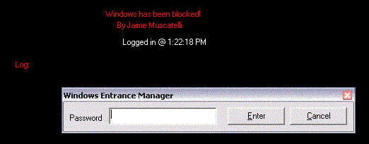



## A Windows Blocker

### Description

This is a simple windows blocker I made for my mother in an hour. It is a full-screen window that (at startup) hides the desktop, hides the toolbar, and closes any window that opens while the program is open! It even blocks the start menu! A simple password dialog. Enter the correct password and it shows everything again and closes itself. Also LOGS the confirmation (or lack thereof) into a dll. You can then view the log and see what time someone entered (or tried to) your computer. Try it out. Uses API as well! KEYWORDS: Windows Blocker Hide Start StartBar Menu Password Dialog Full Screen Access DLL Log Entry
 
### More Info
 

             |
---                |---
**Submitted On**   |2002-12-28 22:17:58
**By**             |[Jaime Muscatelli](https://github.com/Planet-Source-Code/PSCIndex/blob/master/ByAuthor/jaime-muscatelli.md)
**Level**          |Intermediate
**User Rating**    |3.9 (27 globes from 7 users)
**Compatibility**  |VB 6\.0
**Category**       |[Complete Applications](https://github.com/Planet-Source-Code/PSCIndex/blob/master/ByCategory/complete-applications__1-27.md)
**World**          |[Visual Basic](https://github.com/Planet-Source-Code/PSCIndex/blob/master/ByWorld/visual-basic.md)
**Archive File**   |[A\_Windows\_153834222003\.zip](https://github.com/Planet-Source-Code/jaime-muscatelli-a-windows-blocker__1-42894/archive/master.zip)

